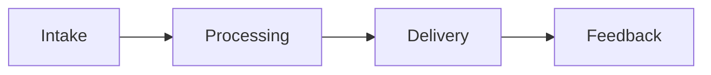

---
title: AI Tourism Recommendation Platform
repo: 1000-startup-ideas
primary_keyword: AI Startup
secondary_keywords:
- Startup Ideas
- Travel
- Innovation
slug: ai-tourism-recommendation-platform
word_count_target: 1200
commit_type: 'idea:'---

# AI Tourism Recommendation Platform

## Introduction

This section covers introduction for AI Tourism Recommendation Platform with focus on AI Startup. Organizations need clear ownership, measurable outcomes, and iterative delivery. Teams should document decisions, validate assumptions with pilots, and align Startup Ideas, Travel, and Innovation with business goals. Teams should document decisions, validate assumptions with pilots, and align Startup Ideas, Travel, and Innovation with business goals. Teams should document decisions, validate assumptions with pilots, and align Startup Ideas, Travel, and Innovation with business goals. Teams should document decisions, validate assumptions with pilots, and align Startup Ideas, Travel, and Innovation with business goals. Teams should document decisions, validate assumptions with pilots, and align Startup Ideas, Travel, and Innovation with business goals. Teams should document decisions, validate assumptions with pilots, and align Startup Ideas, Travel, and Innovation with business goals.  The primary focus is **AI Startup**.

## Problem Statement

This section covers problem for AI Tourism Recommendation Platform with focus on AI Startup. Organizations need clear ownership, measurable outcomes, and iterative delivery. Teams should document decisions, validate assumptions with pilots, and align Startup Ideas, Travel, and Innovation with business goals. Teams should document decisions, validate assumptions with pilots, and align Startup Ideas, Travel, and Innovation with business goals. Teams should document decisions, validate assumptions with pilots, and align Startup Ideas, Travel, and Innovation with business goals. Teams should document decisions, validate assumptions with pilots, and align Startup Ideas, Travel, and Innovation with business goals. Teams should document decisions, validate assumptions with pilots, and align Startup Ideas, Travel, and Innovation with business goals. 

## Solution

This section covers solution for AI Tourism Recommendation Platform with focus on AI Startup. Organizations need clear ownership, measurable outcomes, and iterative delivery. Teams should document decisions, validate assumptions with pilots, and align Startup Ideas, Travel, and Innovation with business goals. Teams should document decisions, validate assumptions with pilots, and align Startup Ideas, Travel, and Innovation with business goals. Teams should document decisions, validate assumptions with pilots, and align Startup Ideas, Travel, and Innovation with business goals. Teams should document decisions, validate assumptions with pilots, and align Startup Ideas, Travel, and Innovation with business goals. Teams should document decisions, validate assumptions with pilots, and align Startup Ideas, Travel, and Innovation with business goals. 

## Architecture or Framework

This section covers architecture for AI Tourism Recommendation Platform with focus on AI Startup. Organizations need clear ownership, measurable outcomes, and iterative delivery. Teams should document decisions, validate assumptions with pilots, and align Startup Ideas, Travel, and Innovation with business goals. Teams should document decisions, validate assumptions with pilots, and align Startup Ideas, Travel, and Innovation with business goals. Teams should document decisions, validate assumptions with pilots, and align Startup Ideas, Travel, and Innovation with business goals. Teams should document decisions, validate assumptions with pilots, and align Startup Ideas, Travel, and Innovation with business goals. Teams should document decisions, validate assumptions with pilots, and align Startup Ideas, Travel, and Innovation with business goals. Teams should document decisions, validate assumptions with pilots, and align Startup Ideas, Travel, and Innovation with business goals. 

## Benefits

This section covers benefits for AI Tourism Recommendation Platform with focus on AI Startup. Organizations need clear ownership, measurable outcomes, and iterative delivery. Teams should document decisions, validate assumptions with pilots, and align Startup Ideas, Travel, and Innovation with business goals. Teams should document decisions, validate assumptions with pilots, and align Startup Ideas, Travel, and Innovation with business goals. Teams should document decisions, validate assumptions with pilots, and align Startup Ideas, Travel, and Innovation with business goals. Teams should document decisions, validate assumptions with pilots, and align Startup Ideas, Travel, and Innovation with business goals. 

## Challenges

This section covers challenges for AI Tourism Recommendation Platform with focus on AI Startup. Organizations need clear ownership, measurable outcomes, and iterative delivery. Teams should document decisions, validate assumptions with pilots, and align Startup Ideas, Travel, and Innovation with business goals. Teams should document decisions, validate assumptions with pilots, and align Startup Ideas, Travel, and Innovation with business goals. Teams should document decisions, validate assumptions with pilots, and align Startup Ideas, Travel, and Innovation with business goals. Teams should document decisions, validate assumptions with pilots, and align Startup Ideas, Travel, and Innovation with business goals. 

## Future Opportunities

This section covers future for AI Tourism Recommendation Platform with focus on AI Startup. Organizations need clear ownership, measurable outcomes, and iterative delivery. Teams should document decisions, validate assumptions with pilots, and align Startup Ideas, Travel, and Innovation with business goals. Teams should document decisions, validate assumptions with pilots, and align Startup Ideas, Travel, and Innovation with business goals. Teams should document decisions, validate assumptions with pilots, and align Startup Ideas, Travel, and Innovation with business goals. Teams should document decisions, validate assumptions with pilots, and align Startup Ideas, Travel, and Innovation with business goals. 

## Conclusion

This section covers conclusion for AI Tourism Recommendation Platform with focus on AI Startup. Organizations need clear ownership, measurable outcomes, and iterative delivery. Teams should document decisions, validate assumptions with pilots, and align Startup Ideas, Travel, and Innovation with business goals. Teams should document decisions, validate assumptions with pilots, and align Startup Ideas, Travel, and Innovation with business goals. Teams should document decisions, validate assumptions with pilots, and align Startup Ideas, Travel, and Innovation with business goals. Teams should document decisions, validate assumptions with pilots, and align Startup Ideas, Travel, and Innovation with business goals. 

## Related Reading

- (pending)
