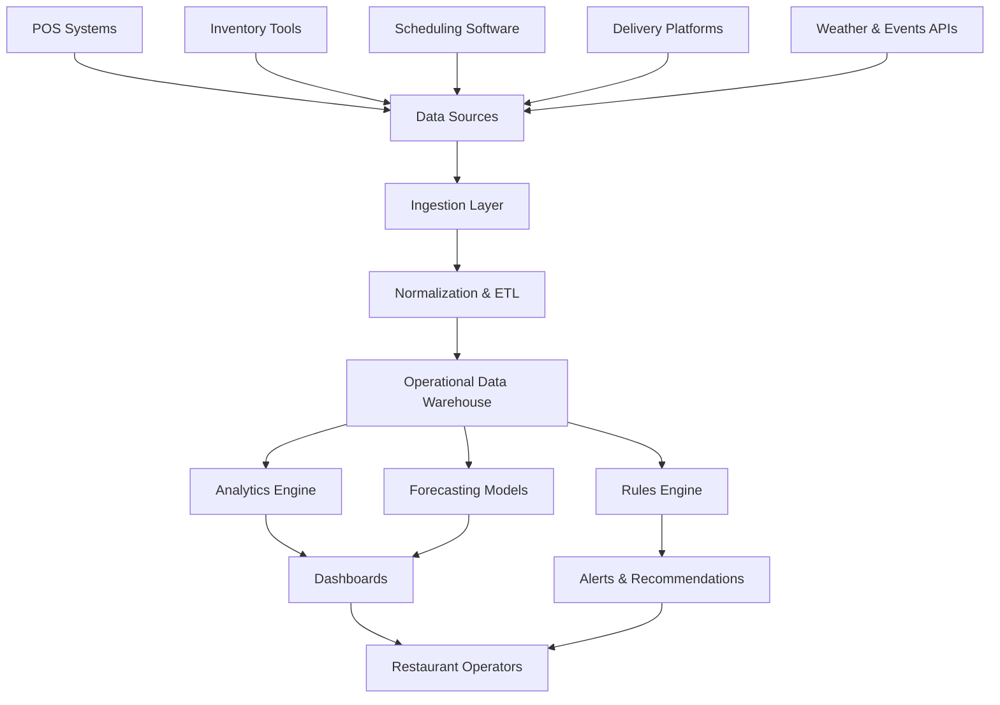

---
title: Restaurant Intelligence SaaS
repo: 1000-startup-ideas
primary_keyword: SaaS Ideas
secondary_keywords:
- AI Startup
- Food Tech
- Business Ideas
slug: restaurant-intelligence-saas
word_count_target: 1200
commit_type: 'idea:'---

# Restaurant Intelligence SaaS: A Practical SaaS Ideas Blueprint for Founders

## Introduction

Among modern **SaaS Ideas**, restaurant intelligence stands out because it solves a problem with constant urgency: restaurants operate on thin margins, volatile demand, and fragmented data. Owners and operators need clearer answers on what to buy, when to staff, how to price, and which menu items actually drive profit. A restaurant intelligence SaaS product turns raw operational data into decisions that improve revenue and reduce waste.

This is a strong opportunity for an **AI Startup** because restaurants already generate useful data from POS systems, online ordering, delivery platforms, inventory tools, and labor schedules. The challenge is not data scarcity; it is data fragmentation. A focused platform can unify these signals and give operators actionable recommendations instead of dashboards they ignore.

For founders exploring **Food Tech** and practical **Business Ideas**, this category is attractive because it can start with one narrow workflow and expand into a broader operating system for restaurants.

## Problem Statement

Restaurant operators typically make decisions with incomplete visibility. A manager may know sales are down, but not whether the cause is menu mix, staffing, local weather, delivery app ranking, or ingredient shortages. This uncertainty creates several expensive problems:

- **Food waste** from poor forecasting and over-ordering
- **Labor inefficiency** from mismatched staffing schedules
- **Margin leakage** from underpriced menu items or discount-heavy promotions
- **Inventory stockouts** that hurt customer satisfaction
- **Slow decision-making** because data lives in separate systems

Most existing restaurant software is siloed. POS tools show transactions, inventory tools show stock, and scheduling tools show labor hours, but few products connect all three in a way that produces recommendations. Even when analytics are available, they are often descriptive rather than prescriptive. Operators do not need another chart; they need a clear action such as “reduce prep for item X by 18% on Tuesdays” or “shift two staff members from 6–9 PM on low-traffic days.”

The core opportunity for **SaaS Ideas** in this space is to build a product that reduces decision friction and improves unit economics at the store level.

## Solution

A restaurant intelligence SaaS should act as a decision layer across restaurant operations. The product can ingest data from multiple sources, normalize it, and generate operational insights in near real time.

A useful initial product can focus on three high-value workflows:

1. **Demand forecasting**
   - Predict daily and hourly demand by location
   - Factor in historical sales, day of week, weather, holidays, events, and promotions
   - Recommend prep quantities and purchasing plans

2. **Labor optimization**
   - Compare forecasted demand with staffing schedules
   - Recommend shift adjustments based on expected traffic and ticket volume
   - Track labor cost as a percentage of sales

3. **Menu profitability analysis**
   - Calculate contribution margin per menu item
   - Identify low-margin items with high prep complexity
   - Recommend price changes, bundling, or menu removal

A strong product should also support alerts and automation. For example, if inventory for a high-selling ingredient is projected to run out in 36 hours, the system can alert the operator and suggest a purchase order quantity.

This is where an **AI Startup** angle becomes valuable: machine learning can improve forecast accuracy over time, but the product should still be useful without heavy AI complexity on day one. Start with rules, thresholds, and clean analytics, then add predictive models once enough data is available.

## Architecture or Framework

A practical restaurant intelligence SaaS architecture should be modular and designed for integration-first growth.

### Recommended framework

**1. Data ingestion**
- Build connectors for common POS systems such as Toast, Square, Clover, and Lightspeed
- Add scheduling and inventory integrations where possible
- Use webhook-based ingestion for near real-time updates, and batch sync for slower systems

**2. Data model**
- Normalize core entities: locations, items, orders, ingredients, shifts, vendors, and promotions
- Create a location-level time series model for sales, labor, and inventory
- Maintain a clean mapping between menu items and ingredient usage

**3. Analytics and prediction**
- Start with SQL-based metrics and business rules
- Add forecasting using time-series methods such as Prophet, XGBoost, or LSTM depending on data quality
- Use anomaly detection for sudden dips in sales, unusual waste, or labor overruns

**4. Product layer**
- Build dashboards for owners, general managers, and kitchen managers
- Include weekly summaries, exception alerts, and recommended actions
- Make mobile-friendly views because restaurant managers rarely sit at a desktop all day

**5. Security and reliability**
- Use role-based access control for multi-location businesses
- Encrypt data in transit and at rest
- Track audit logs for operational changes and user actions

A good framework for product design is: **observe → predict → recommend → automate**. First, the system observes data. Then it predicts outcomes, recommends actions, and eventually automates low-risk workflows such as alerts, reorder drafts, or schedule suggestions.

## Benefits

A well-built restaurant intelligence SaaS can create measurable value quickly.

### For restaurant owners
- Lower food waste through better forecasting
- Higher gross margin by identifying unprofitable menu items
- Better labor planning and reduced overtime
- Faster decision-making across locations

### For operators and managers
- Clear daily priorities instead of scattered reports
- Fewer stockouts and fewer emergency purchases
- Better schedule alignment with actual demand
- Easier performance tracking across shifts and stores

### For the SaaS business
- Strong retention if the product becomes part of weekly operations
- Expansion potential from one store to multi-unit chains
- Clear ROI story, which improves sales conversion
- Natural upsell paths into procurement, pricing, and workforce optimization

This category also benefits from measurable metrics. A founder can prove value using:
- Food cost reduction percentage
- Labor cost as a percentage of sales
- Forecast accuracy by location
- Waste reduction in dollars
- Increase in contribution margin per menu item

These metrics make the product easier to sell because the buyer can connect software usage to business outcomes.

## Challenges

Restaurant intelligence SaaS is promising, but execution is difficult.

### Integration complexity
Restaurants use many systems, and each one has different APIs, data formats, and sync limitations. A founder may need to support CSV imports before full integrations are ready.

### Data quality
Many restaurants have inconsistent item naming, incomplete inventory records, and missing labor data. The product must include data cleaning and mapping tools, or forecasts will be unreliable.

### Operational trust
Managers will not follow recommendations if the system feels inaccurate or disconnected from reality. Early versions should explain why a recommendation was made, not just present a number.

### Long sales cycles
Independent restaurants may buy quickly, but multi-location chains often require procurement review, pilot testing, and proof of ROI. A founder should choose a clear initial segment.

### Thin budgets
Restaurants are cost-sensitive. Pricing must align with visible savings. A flat monthly fee may work for small operators, while larger chains may accept location-based pricing or usage-based tiers.

The main trade-off is between breadth and depth. A broad platform is attractive, but a narrow workflow with strong ROI is easier to sell and support.

## Future Opportunities

The long-term opportunity for **SaaS Ideas** in restaurant intelligence is to move from analytics to autonomous operations.

### Predictive procurement
The platform can automatically generate vendor purchase suggestions based on demand forecasts, historical usage, and lead times.

### Dynamic pricing
For restaurants with flexible menus or delivery-heavy channels, the system can recommend price changes based on demand patterns, ingredient costs, and margin targets.

### AI-assisted menu engineering
An **AI Startup** can use clustering and profitability analysis to suggest better menu structures, such as removing low-margin items or grouping items into higher-conversion bundles.

### Multi-location benchmarking
Chains can compare store performance across locations, identify outliers, and standardize best practices.

### Voice and conversational interfaces
Managers could ask, “Why was labor high on Friday?” or “What should we prep for lunch tomorrow?” and receive concise answers in plain language.

### Vertical expansion
The same architecture can expand into cafés, ghost kitchens, quick-service restaurants, and catering businesses. Each segment has different workflows, but the core data model remains similar.

Over time, the product could become the operating intelligence layer for **Food Tech** businesses that need better forecasting, tighter margins, and faster execution.

## Conclusion

Restaurant intelligence SaaS is one of the most practical **Business Ideas** for founders who want a clear ROI story and a real operational pain point. Restaurants already have data, but they lack a system that turns that data into decisions. A focused product that improves forecasting, labor planning, and menu profitability can create immediate value and strong customer retention.

The best path is to start small: pick one segment, solve one workflow, and prove measurable savings. Once the product earns trust, expand into additional recommendations, automation, and multi-location intelligence. For founders looking at **SaaS Ideas**, this is a category where software can directly improve margins, not just reporting.

## Related Reading

- (pending)