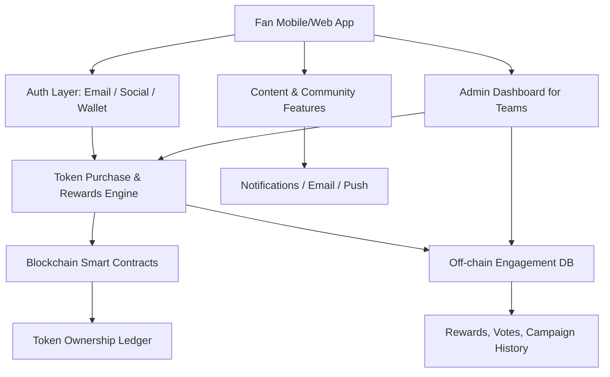

---
title: Sports Fan Token Platform
repo: 1000-startup-ideas
primary_keyword: Blockchain Startups
secondary_keywords:
- Startup Ideas
- Innovation
- Business Ideas
slug: sports-fan-token-platform
word_count_target: 1200
commit_type: 'idea:'---

# Sports Fan Token Platform

## Introduction

**Blockchain Startups** are increasingly moving beyond speculative crypto products and into utility-driven platforms with clear user communities. One of the most promising **Startup Ideas** in this category is a sports fan token platform: a product that lets teams, leagues, or independent fan communities issue digital tokens that unlock voting, rewards, access, and loyalty benefits.

For founders, this is not just another Web3 concept. It is a business model built around recurring fan engagement, digital ownership, and monetizable community interactions. Sports organizations already have passionate audiences, frequent content cycles, and strong identity-based participation. A token layer can turn passive fandom into measurable engagement and new revenue streams.

The opportunity is especially relevant for **Business Ideas** that sit at the intersection of ticketing, loyalty, collectibles, memberships, and creator-style community economics. If designed well, a sports fan token platform can serve clubs, esports teams, athlete brands, and even local sports communities.

## Problem Statement

Sports organizations struggle with three persistent problems:

1. **Low fan retention between games or seasons**  
   Fans engage heavily around match days, but activity drops sharply afterward. Traditional apps and newsletters rarely create ongoing interaction.

2. **Weak monetization of digital communities**  
   Teams often depend on tickets, sponsorships, and merchandise. These are effective but limited. There is little infrastructure for monetizing fan participation itself.

3. **Fragmented loyalty systems**  
   Fans may use a team app, a ticketing provider, a merch store, and a social media channel, but these systems do not connect into a single identity or reward layer.

A sports fan token platform addresses this by creating a portable digital membership system. However, many early attempts failed because they focused on speculation instead of utility. Token price volatility, poor UX, and unclear benefits caused user churn. The core challenge is to build a product that feels like a sports engagement platform first and a blockchain product second.

## Solution

A successful sports fan token platform should provide a clear set of utilities:

- **Voting rights** on non-critical fan decisions, such as jersey designs, playlist selections, or matchday experiences
- **Loyalty rewards** for attendance, purchases, referrals, and social engagement
- **Access control** for exclusive content, Q&A sessions, early ticket drops, or VIP community channels
- **Digital collectibles** tied to milestones, player achievements, or limited campaigns
- **Membership tiers** that combine token ownership with subscription-style benefits

The best model is a hybrid of Web2 and Web3. Fans should be able to sign up with email or social login, buy tokens with fiat or crypto, and use them immediately without needing to understand wallets, gas fees, or seed phrases. The blockchain layer should handle ownership, scarcity, and verifiable transactions, while the front end focuses on simple fan experiences.

Revenue can come from several sources:

- Primary token sales
- Marketplace transaction fees
- Premium memberships
- Sponsored campaigns and branded drops
- B2B licensing for teams and leagues

For founders, the strongest wedge is often a niche market: a single club, a local league, or an esports organization. Once the product proves engagement lift and retention, it can expand into a multi-tenant SaaS platform for sports brands.

## Architecture or Framework

A practical architecture for a sports fan token platform should prioritize scalability, low transaction costs, and simple user onboarding.

### Core components

**1. Frontend app**  
Use React, Next.js, or Flutter for a mobile-first experience. The UI should emphasize actions fans understand: buy, vote, claim, unlock, and share.

**2. Authentication layer**  
Support email login, OAuth, and optional non-custodial wallets. A custodial wallet abstraction can reduce friction for new users.

**3. Smart contracts**  
Use ERC-20 or similar fungible token standards for fan currency, and ERC-721 or ERC-1155 for collectibles. Keep contracts minimal and audited. Avoid putting all business logic on-chain.

**4. Off-chain engagement engine**  
Store campaign rules, reward points, user activity, and eligibility checks in a database such as PostgreSQL or Firestore. This improves performance and reduces gas costs.

**5. Admin dashboard**  
Teams need a dashboard to launch campaigns, approve rewards, configure voting rules, and monitor fan participation. Without this, the product becomes too dependent on engineering.

### Suggested framework for execution

A good rollout framework is:

- **Phase 1: Single-team pilot**  
  Launch with one sports property and one clear utility, such as voting on matchday perks.
- **Phase 2: Loyalty expansion**  
  Add attendance rewards, merch-based incentives, and content unlocks.
- **Phase 3: Marketplace and partnerships**  
  Introduce token trading, sponsor rewards, and cross-team campaigns.
- **Phase 4: Multi-tenant SaaS**  
  Offer the platform to multiple teams with configurable branding and analytics.

### Key metrics to track

- Monthly active fans
- Token holders per campaign
- Conversion rate from app visitor to token buyer
- Repeat engagement rate
- Revenue per fan
- Cost to acquire a token holder
- Retention after 30, 60, and 90 days

## Benefits

A sports fan token platform can create value for both the organization and the fan base.

### For teams and leagues

- **New revenue streams** beyond ticketing and sponsorships
- **Higher fan retention** through recurring token utilities
- **Better audience data** via wallet-linked identity and engagement history
- **Stronger sponsorship inventory** through token-gated campaigns

### For fans

- **Recognition and status** for active participation
- **Exclusive access** to events, content, and decisions
- **A sense of ownership** in the community
- **Portable rewards** that can be used across campaigns

### For founders

- Clear niche positioning within **Blockchain Startups**
- A recurring SaaS + transaction-fee business model
- Expansion potential into esports, entertainment, and creator memberships
- Strong storytelling for investors interested in fan economy products

## Challenges

This category has meaningful risks, and founders should address them early.

### Regulatory uncertainty

Token products can be interpreted differently depending on jurisdiction. If tokens are marketed as investments or have profit expectations, they may trigger securities concerns. The safest approach is to frame them as utility tokens with clear non-financial benefits.

### User onboarding friction

Wallet creation, gas fees, and token custody can confuse mainstream fans. Abstracting blockchain complexity is essential. Custodial wallets, fiat checkout, and familiar UX patterns reduce drop-off.

### Speculation and volatility

If token prices fluctuate too much, fans may treat the platform like a trading app rather than a community product. This can damage trust and distract from utility. A stable reward economy is usually more sustainable than pure market speculation.

### Poor product-market fit

Not every sports property has enough engagement to justify a token layer. Teams with weak digital communities may not see enough adoption. Founders should validate demand with pilot campaigns before building a full platform.

### Security and reputation risk

Smart contract bugs, phishing attacks, and reward abuse can create financial and brand damage. Audits, rate limiting, and fraud detection are not optional.

## Future Opportunities

The long-term potential for sports fan token platforms is broader than simple fan voting.

### Cross-platform loyalty networks

Tokens could work across clubs, leagues, and partner brands, creating a shared reward layer for sports consumers.

### Dynamic utility based on performance

Token perks could change based on team performance, player milestones, or season stages. This creates a more responsive fan experience.

### Integration with ticketing and merchandise

Tokens can become part of a larger commerce stack, offering discounts, priority access, and verified resale rights.

### AI-driven personalization

Fan behavior data can be used to personalize rewards, campaign timing, and content recommendations. This turns the platform into a smarter engagement engine.

### Global fan monetization

International fans often cannot attend games but still want participation. Tokens provide a way to monetize global communities without relying only on physical attendance.

For founders exploring **Innovation** in sports technology, the most attractive path is to combine utility, identity, and community economics into one platform. That makes the product more defensible than a simple token launch.

## Conclusion

A sports fan token platform is one of the more credible **Startup Ideas** within **Blockchain Startups** because it solves real problems: fan retention, monetization, and loyalty fragmentation. The winning product is not a speculative token exchange. It is a practical engagement platform with clear fan benefits, low-friction onboarding, and measurable business outcomes.

Founders should start small, focus on utility, and prove that tokens increase engagement and revenue for a specific sports community. If the pilot succeeds, the opportunity can expand into a broader SaaS business serving clubs, leagues, and entertainment brands. In a market crowded with weak token concepts, the teams that win will be the ones that treat fan trust, product design, and operational simplicity as first-class priorities.

## Related Reading

- (pending)